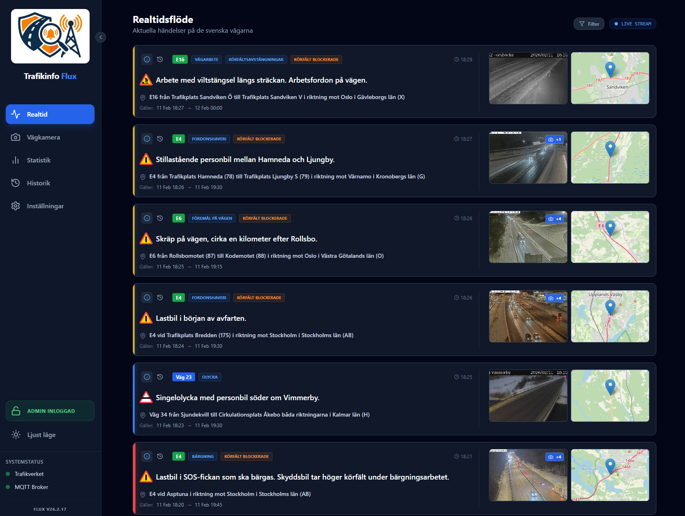

# 🚦 Trafikinfo Flux

[](https://github.com/Minglarn/trafikinfo)
[](https://opensource.org/licenses/MIT)

[](https://www.python.org/)




Trafikinfo Flux är en Docker-baserad plattform för att övervaka realtidsdata från det svenska Trafikverkets API. Systemet strömmar händelser (Situationer), lagrar dem i en lokal databas för historik och kan automatiskt pusha utvalda händelser till en MQTT-broker.

## Funktioner

- **SSE Streaming**: Direktuppkoppling mot Trafikverket för händelser i realtid.
- **Kartvisualisering**: Interaktiva kartor för att se exakt var händelser sker.
- **Statistik & Analys**: Dashboard som visar trender och fördelning av trafikstörningar.
- **MQTT Bridge**: Skickar vidare trafikdata till ditt smarta hem eller andra system.
- **Ljudaviseringar**: Möjlighet att få ljudsignaler vid nya händelser.
- **Web GUI**: Modernt, responsivt gränssnitt med mörkt läge.
- **Historik**: Sökbar databas över alla historiska händelser.

## Kom igång med Docker Compose

Det snabbaste sättet att starta Trafikinfo Flux är att använda Docker Compose.

### 1. Förberedelser
Du behöver en API-nyckel från [Trafikverket Datautbytesportal](https://dataportalen.trafikverket.se/).

### 2. Konfiguration
Vi rekommenderar att du använder en `.env`-fil för att hålla dina inloggningsuppgifter säkra.

1. Kopiera exempel-filen:
   ```bash
   cp .env.example .env
   ```
2. Öppna `.env` och fyll i din `TRAFIKVERKET_API_KEY` samt MQTT-detaljer.

### 3. Docker Compose (`docker-compose.yml`)
Din `docker-compose.yml` kan sedan hållas ren och referera till `.env`-filen:

```yaml
services:
  trafikinfo:
    image: ghcr.io/minglarn/trafikinfo:latest
    container_name: trafikinfo-flux
    ports:
      - "7081:8000"
    volumes:
      - ./data:/app/data
    restart: always
    env_file: .env
    environment:
      - TZ=Europe/Stockholm
```

### 4. Starta
Kör följande kommando i samma mapp:
```bash
docker-compose up -d
```

Öppna sedan [http://localhost:7081](http://localhost:7081) i din webbläsare.

## Teknikstack

Projektet är byggt med följande teknologier:

- **Programspråk**: Python (Backend) & JavaScript/HTML5 (Frontend)
- **Backend Framework**: FastAPI, SSE-Starlette
- **Frontend Framework**: React, Vite, Tailwind CSS, Framer Motion
- **Kartor**: Leaflet
- **Databas**: SQLite (SQLAlchemy)
- **Kommunikation**: MQTT (Paho-MQTT), SSE (HTTP)

## Licens
Detta projekt är licensierat under **MIT License**.
