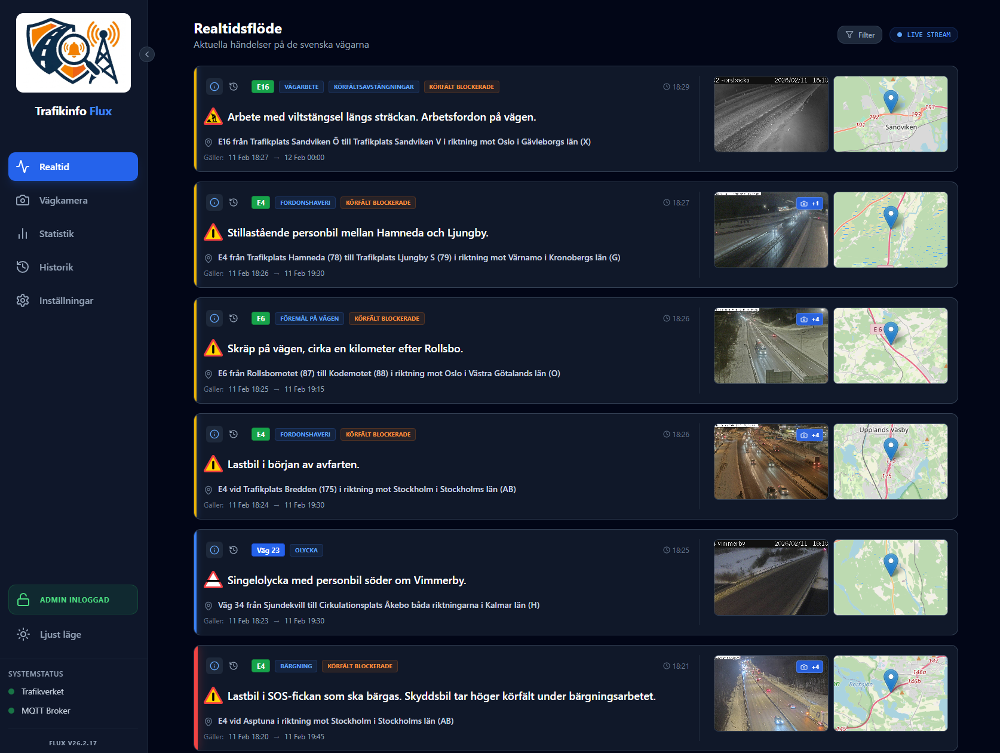

# 🚦 Trafikinfo Flux

[](https://github.com/Minglarn/trafikinfo)
[](https://opensource.org/licenses/MIT)

[](https://www.python.org/)




Ett modernt system för att visa trafikinformation från Trafikverket i realtid. Systemet består av en backend i Python (FastAPI) och en frontend i React (PWA) med fokus på hastighet, estetik och användarnytta.

## Funktioner

- **Push-notiser (PWA)**: Realtidsaviseringar direkt i din webbläsare eller telefon med dynamiska ikoner per händelsetyp.
- **Family Model & Multi-User Sync**: Inställningar och bevakade län synkas sömlöst mellan dina enheter. Varje användare kan ha sin egen unika bevakningslista.
- **Markmarkerade län**: Kraftfull filtrering där du endast ser händelser och väglag för de län DU valt att bevaka.
- **Väglag & Friktion (Road Conditions)**: Detaljerad information om yttemperatur, lufttemperatur, vind och friktion (grip). Allt samlat i en logisk grid för snabb överblick.
- **Färska Kamerabilder**: Systemet hämtar automatiskt en ny kamerabild vid varje uppdatering av ett väglag, så att du alltid ser den senaste bilden.
- **Realtidsflöde (SSE)**: Blixtsnabb uppdatering av trafikstörningar utan att behöva ladda om sidan.
- **Historik**: Sökbar databas över alla historiska händelser och versionsändringar för att se hur en situation utvecklats över tid.
- **MQTT-Integration**: Fullt stöd för Home Assistant och andra system via MQTT för både händelser och väglag.
- **Vägkamera / Dashboard**: En dedikerad vy för att bläddra bland alla trafik- och väglagskameror. Inkluderar en interaktiv karta och en favorit-grid (Dashboard) som sparas lokalt i webbläsaren.
- **Händelsekarta (Event Map)**: Visualisera alla händelser geografiskt på en fullskärmskarta med marker-clustering och realtidsuppdateringar.

## Kom igång med Docker Compose

Det snabbaste sättet att starta Trafikinfo Flux är att använda Docker Compose. All konfiguration sker sedan direkt i webbgränssnittet.

### 1. Förberedelser
Du behöver en API-nyckel från [Trafikverket Datautbytesportal](https://dataportalen.trafikverket.se/).

### 2. Docker Compose (`docker-compose.yml`)
Skapa en `docker-compose.yml` med följande innehåll:

```yaml
services:
  trafikinfo:
    image: ghcr.io/minglarn/trafikinfo:latest
    container_name: trafikinfo-flux
    ports:
      - "7081:8000"
    volumes:
      - ./data:/app/data
    restart: always
    environment:
      - TZ=Europe/Stockholm
      - ADMIN_PASSWORD=${ADMIN_PASSWORD:-admin123}
      - APP_PASSWORD=${APP_PASSWORD:-flux123}
      - NO_LOGIN_NEEDED=${NO_LOGIN_NEEDED:-false} # Sätt till true för att slippa inloggning
      - SECURE_COOKIES=${SECURE_COOKIES:-false}    # Sätt till true om du kör bakom HTTPS reverse proxy
      - DEBUG_MODE=false # Användbart för att felsöka true|false
```

### 3. Starta
Kör följande kommando i samma mapp:
```bash
docker-compose up -d
```

#### 4. Konfiguration & Säkerhet

Systemet använder en tvåstegs-säkerhetsmodell för att balansera användarvänlighet (PWA/iOS) med administrativ kontroll.

#### App-lösenord (Vanlig användare)
För att få tillgång till realtidsinformationen behöver du ange ett av lösenorden definierade i `APP_PASSWORD`.
- **iOS/PWA**: Lösenordet sparas i en `HttpOnly` session-cookie som gäller i 30 dagar, så att du slipper logga in varje gång du öppnar appen.
- **Flera lösenord**: Du kan ange flera giltiga lösenord separerade med kommatecken, t.ex. `hemligt123,flux456,lösenord789`.

> [!IMPORTANT]
> **HTTP vs HTTPS — `SECURE_COOKIES`**
>
> Session-cookien (`flux_session`) skickas vid varje API-anrop för att bevisa att du är inloggad.
> `SECURE_COOKIES` styr om webbläsaren **bara** får skicka denna cookie över krypterad (HTTPS) trafik.
>
> | `SECURE_COOKIES` | Cookie-flagga | Resultat |
> |---|---|---|
> | `false` (standard) | `Secure` **av** | Cookien skickas över **både HTTP och HTTPS**. Krävs för LAN-access (`http://192.168.1.x`). |
> | `true` | `Secure` **på** | Cookien skickas **bara över HTTPS**. Skyddar mot avlyssning på publika nät. |
>
> **Hemma-LAN →** Använd `false` (standard). Du litar på ditt eget nät.

> **Publikt internet →** Kör alltid bakom en HTTPS reverse proxy (t.ex. Nginx/Caddy + Let's Encrypt) och sätt `SECURE_COOKIES=true` i `docker-compose.yml`.
>
> *OBS: Push-notiser kräver HTTPS av en separat anledning (webbläsarkrav för Service Workers) och styrs **inte** av denna inställning.*

#### Admin-lösenord (Inställningar & Felsökning)
För att ändra systeminställningar, hantera push-notiser eller utföra en fabriksåterställning krävs `ADMIN_PASSWORD`.
1. Öppna [http://localhost:7081](http://localhost:7081).
2. Klicka på lås-ikonen i sidomenyn.
3. Ange ditt `ADMIN_PASSWORD`.
4. Du har nu tillgång till fliken **Inställningar**.

#### No-Login Mode (Lokal Access)
Om du kör systemet i en skyddad miljö (t.ex. hemma-LAN) och vill slippa logga in på dina enheter kan du aktivera "No-Login Mode".
1. Lägg till `NO_LOGIN_NEEDED=true` i din `docker-compose.yml` (under environments) eller i `.env`.
2. Starta om behållaren (`docker-compose up -d`).
3. Appen kommer nu att hoppa över inloggningsskärmen automatiskt.
*OBS: Admin-gränssnittet kräver fortfarande alltid lösenord.*


## 🏠 Home Assistant & MQTT

Trafikinfo Flux kan skicka realtidsaviseringar till Home Assistant via MQTT.

### MQTT Payload
Varje gång en ny händelse detekteras publiceras ett JSON-objekt på ämnet `trafikinfo/traffic` (standard). TrafikInfo FLUX känner av om den körs på en egen domän och applicerar den i länkarna. Annars används den lokala IP-adressen.   
Payloaden innehåller nu färdiga länkar för notiser:

```json
{
  "external_id": "GUIDc5f8b455-690d-41bf-9ee3-26ee2b778791",
  "title": "Räddningsinsats på Älvsborgsbron...",
  "description": null,
  "location": "E6.20 från Bräckemotet till Rödastensmotet...",
  "icon_id": "trafficMessage",
  "event_type": "Situation",
  "timestamp": "2026-02-11T19:06:17.480+01:00",
  "message_type": "Hinder på vägbanan, Vägen avstängd",
  "severity_code": 5,
  "severity_text": "Mycket stor påverkan",
  "region": "Södermanland",
  "timeout": 2400,
  "road_number": "E6",
  "start_time": "2026-02-11T19:05:03.000+01:00",
  "end_time": "2026-02-11T19:45:00.000+01:00",
  "temporary_limit": null,
  "traffic_restriction_type": null,
  "latitude": 57.6932,
  "longitude": 11.9000,
  "icon_url": "http://192.168.1.50:7081/api/icons/trafficMessage.png",
  "external_icon_url": "https://api.trafikinfo.trafikverket.se/v1/icons/trafficMessage?type=png32x32",
  "mdi_icon": "mdi:alert",
  "camera_name": "Älvsborgsbron Norra söderut",
  "camera_snapshot": "GUIDc5f8...jpg",
  "snapshot_url": "http://192.168.1.50:7081/api/snapshots/GUIDc5f8...jpg",
  "event_url": "http://192.168.1.50:7081/?event_id=GUIDc5f8...",
  "external_camera_url": "https://api.trafikinfo.trafikverket.se/...",
  "extra_cameras": "[{\"id\": \"...\", \"name\": \"...\", \"snapshot\": \"...\", \"snapshot_url\": \"...\"}]",
  "weather": {
    "air_temperature": 2.5,
    "road_temperature": 1.2,
    "grip": 0.5,
    "wind_speed": 3.2,
    "wind_direction": "S",
    "ice_depth": 0,
    "snow_depth": 0,
    "water_equivalent": 0
  }
}
```

### Road Conditions (Väglag) MQTT Payload
Information om väglag publiceras på `trafikinfo/road_conditions` (standard).

```json
{
  "id": 6000,
  "external_id": "GUID7ac91d88-b9b6-4409-b6ff-8e4d4e3a7c1d",
  "condition_code": 3,
  "condition_text": "Lössnö",
  "measure": "Halkbekämpning pågår",
  "warning": "Risk för halka",
  "cause": "Snöfall",
  "location_text": "Lämmetshöjen",
  "icon_id": "roadConditionSnow",
  "icon_url": "http://192.168.1.50:7081/api/icons/roadConditionSnow.png",
  "road_number": "E18",
  "start_time": "2026-02-13T07:54:00",
  "end_time": null,
  "latitude": 59.324,
  "longitude": 14.231,
  "county_no": 17,
  "camera_url": "http://192.168.1.50:7081/api/snapshots/GUID396...jpg",
  "camera_name": "Lämmetshöjen",
  "camera_snapshot": "GUID396...jpg",
  "timestamp": "2026-02-13T08:55:12",
  "weather": {
    "air_temperature": -2.1,
    "road_temperature": -3.5,
    "grip": 0.35,
    "wind_speed": 4.5,
    "wind_direction": "NE",
    "ice_depth": 0.2,
    "snow_depth": 0,
    "water_equivalent": 0
  }
}
```

### Exempel på Automation i Home Assistant
Använd följande YAML för att få notiser om trafikolyckor:

```yaml
alias: "Trafikavisering: Olycka"
trigger:
  - platform: mqtt
    topic: "trafikinfo/traffic"
condition:
  - condition: template
    value_template: "{{ trigger.payload_json.severity_code >= 3 }}"
action:
  - service: notify.mobile_app_din_telefon
    data:
      title: "⚠️ {{ trigger.payload_json.title }}"
      message: "{{ trigger.payload_json.location }}"
      data:
        image: "{{ trigger.payload_json.snapshot_url }}" # Ändra till external_camera_url om du har Basic Auth
        clickAction: "{{ trigger.payload_json.event_url }}"
        tag: "{{ trigger.payload_json.external_id }}"
        icon_url: "{{ trigger.payload_json.mdi_icon }}" # Använd mdi_icon för native HA-stöd (slipp Basic Auth)
```

#### Automation för Väglag (Halka)
Få aviseringar när väglaget försämras i dina bevakade län:

```yaml
alias: "Trafikavisering: Halka"
trigger:
  - platform: mqtt
    topic: "trafikinfo/road_conditions"
condition:
  - condition: template
    value_template: "{{ trigger.payload_json.warning != none }}"
action:
  - service: notify.mobile_app_din_telefon
    data:
      title: "❄️ Väglag: {{ trigger.payload_json.condition_text }}"
      message: "{{ trigger.payload_json.location_text }}: {{ trigger.payload_json.warning }}. {{ trigger.payload_json.measure }}"
      data:
        image: "{{ trigger.payload_json.camera_url }}"
        tag: "{{ trigger.payload_json.external_id }}"
```

> [!TIP]
> Appen rapporterar automatiskt sin adress (`base_url`) till servern när du öppnar PWA-gränssnittet. Detta gör att länkarna i MQTT-notiserna alltid pekar rätt.

## Teknikstack

Projektet är byggt med följande teknologier:

- **Programspråk**: Python (Backend) & JavaScript/HTML5 (Frontend)
- **Backend Framework**: FastAPI, SSE-Starlette
- **Frontend Framework**: React, Vite, Tailwind CSS, Framer Motion
- **Kartor**: Leaflet
- **Databas**: SQLite (SQLAlchemy)
- **Kommunikation**: MQTT (Paho-MQTT), SSE (HTTP)

## Licens
Detta projekt är licensierat under **MIT License**.

## Tack till 
Ett stort tack till [@tubalainen](https://github.com/tubalainen) för att ha hittat och rapporterat buggen gällande länsfiltrering för vägkameror!
